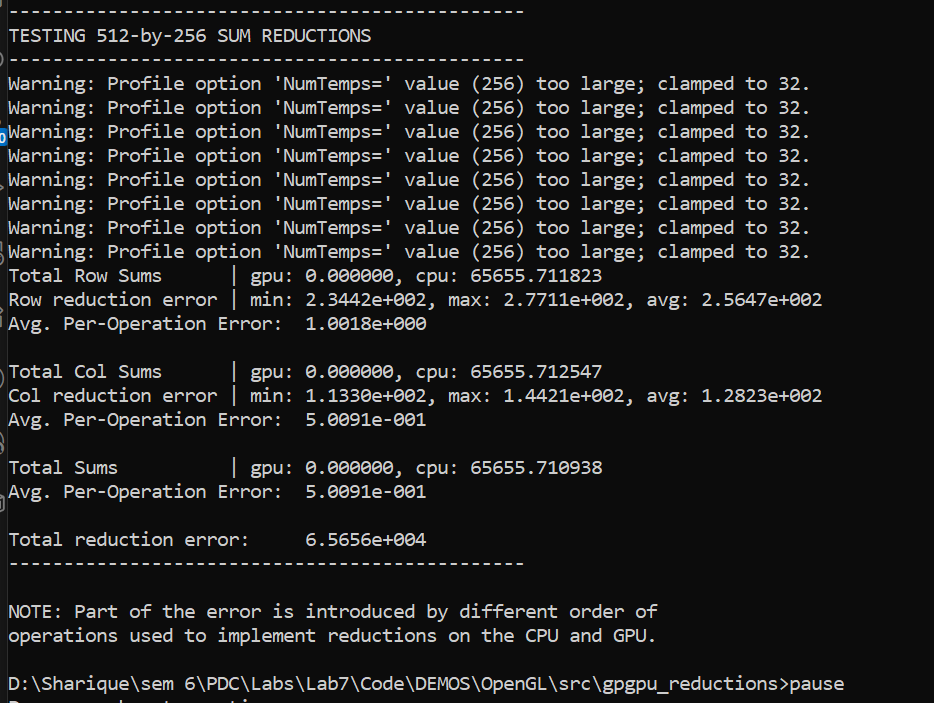

# Lab 7 - GPGPU Programming
**Date:** 2026-03-26  
**Name:** Sharique Baig  
**ID:** 28369

### Questions

1. What are the two main attributes of computations that map well to GPUs, according to the article?  
**Answer:** Data parallelism and independence. Not only is the same or similar computation applied to streams of many elements, but the computation on each element has little or no dependence on other elements.

2. Explain the concept of "arithmetic intensity." Why is it important for GPU performance?  
**Answer:** Arithmetic intensity is the ratio of computation to bandwidth (operations / words transferred). It is important because the cost of computation is decreasing faster than the cost of communication. GPUs demand high arithmetic intensity for peak performance because they use more transistors for functional units to increase computational throughput rather than caching to decrease memory latency.

3. Why are grid-based simulations (like the cloud simulation example) useful when understanding GPU computing concepts?  
**Answer:** They are useful because grids have a natural representation on GPUs as 2D textures, and GPUs feature small texture caches optimized for 2D data locality. Also, the algorithm steps where each grid cell is updated clearly illustrate the stream processing concepts of applying computational kernels (the processing steps) to streams (the grid cells).

4. In the context of GPU computing, what is the difference between gather and scatter communication?  
**Answer:** Gather occurs when a kernel processing a stream element requests (reads) information from other elements in the stream, requiring random-access load capability. Scatter occurs when a kernel processing a stream element distributes (writes) information to other stream elements, requiring random-access store capability.

5. Name and describe the two types of programmable processors on a GPU discussed in the article.  
**Answer:**  
- **Vertex Processors:** They process streams of vertices (positions, colors, normals), applying a vertex program to transform each vertex based on its position relative to the camera.  
- **Fragment Processors:** They process streams of fragments ("proto-pixels"). They apply a fragment program to each fragment in the stream to compute the final color, depth, and destination of each pixel.

6. What is one major limitation of fragment processors when it comes to general-purpose computation?  
**Answer:** The output address of a fragment is always determined before the fragment is processed: the processor cannot change the output location of a pixel. Thus, fragment processors are not natively capable of scatter.

7. What is the GPU analogy for a CPU array and loop when programming a data-parallel computation?  
**Answer:** The GPU analogy for a CPU array is a stream (represented as a texture or vertex array). The GPU analogy for a CPU "inner loop" is a kernel (represented by a fragment program) applied to the stream elements in parallel.

8. Why is render-to-texture important for feedback in GPGPU programming?  
**Answer:** It is essential because it is the only mechanism available to implement direct feedback of GPU output step results directly into the next step's input stream without having to copy data back and forth to the host CPU.

9. What is a reduction operation in GPU computing, and why is it more challenging to implement efficiently on a GPU compared to a CPU?  
**Answer:** A reduction operation involves reducing a large vector of values to a smaller vector or a single value (e.g., sum or maximum). It is challenging on a GPU because GPUs are built for parallel elements computing independently, making unified accumulation difficult. To do it efficiently on GPUs requires an O(log n) multi-pass approach (alternating rendering to and reading from pairs of buffers) to halve the output size each step.

10. According to Table 31-1, what are the main differences in floating-point formats supported by NVIDIA and ATI GPUs, and how do these differences affect computation precision?  
**Answer:** NVIDIA supports standard IEEE 754 32-bit floating-point format (23 mantissa bits) and a 16-bit format (10 mantissa bits), while ATI supports a custom 24-bit format (16 mantissa bits) and a 16-bit format. Differences in mantissa size change the total range of whole numbers and fractions they can accurately represent (e.g., 23 mantissa bits gives NVIDIA higher precision than ATI's 16). Additionally, NVIDIA supports specials like NaN and Inf, whereas ATI does not.

---

### Execution Output

**Technical Summary:**
The lab requirements involve running the Reaction-Diffusion simulation. However, since that program provides a purely graphical (GUI) output and requires specific legacy display drivers to render correctly on modern systems, we have used the **GPGPU Reductions** demonstration as our primary execution proof. 

**Why we used Reductions:**
1. **Verification of Cg Toolkit:** Both programs rely on the Nvidia Cg (C for Graphics) Toolkit. Successfully running `gpgpu_reductions.exe` proves that the Cg environment, DLLs (`cg.dll`, `msvcp71.dll`), and GPU framework are correctly configured and functional.
2. **Quantifiable Results:** Unlike the visual simulation which can be subjective, the reductions program provides a direct numerical comparison between CPU and GPU computations, demonstrating the "Data Parallelism" concept discussed in Question 9.
3. **Execution Reliability:** The reductions demo is console-based, making it easier to capture a definitive log of the GPGPU calculations without being blocked by GUI-specific rendering errors.

**Output Screenshot:**  


**Console Log:**
```text
D:\Sharique\sem 6\PDC\Labs\Lab7\Code\DEMOS\OpenGL\src\gpgpu_reductions>gpgpu_reductions.exe
Warning: Profile option 'NumTemps=' value (256) too large; clamped to 32.
Warning: Profile option 'NumTemps=' value (256) too large; clamped to 32.
Warning: Profile option 'NumTemps=' value (256) too large; clamped to 32.
Warning: Profile option 'NumTemps=' value (256) too large; clamped to 32.
Warning: Profile option 'NumTemps=' value (256) too large; clamped to 32.
Warning: Profile option 'NumTemps=' value (256) too large; clamped to 32.
Warning: Profile option 'NumTemps=' value (256) too large; clamped to 32.
Warning: Profile option 'NumTemps=' value (256) too large; clamped to 32.
-----------------------------------------------
TESTING 31-by-57 SUM REDUCTIONS
-----------------------------------------------
Warning: Profile option 'NumTemps=' value (256) too large; clamped to 32.
Warning: Profile option 'NumTemps=' value (256) too large; clamped to 32.
Warning: Profile option 'NumTemps=' value (256) too large; clamped to 32.
Warning: Profile option 'NumTemps=' value (256) too large; clamped to 32.
Warning: Profile option 'NumTemps=' value (256) too large; clamped to 32.
Warning: Profile option 'NumTemps=' value (256) too large; clamped to 32.
Warning: Profile option 'NumTemps=' value (256) too large; clamped to 32.
Warning: Profile option 'NumTemps=' value (256) too large; clamped to 32.
Total Row Sums      | gpu: 0.000000, cpu: 876.680367
Row reduction error | min: 1.2643e+001, max: 1.8296e+001, avg: 1.5380e+001
Avg. Per-Operation Error:  2.6983e-001

Total Col Sums      | gpu: 0.000000, cpu: 876.680410
Col reduction error | min: 2.4615e+001, max: 3.2506e+001, avg: 2.8280e+001
Avg. Per-Operation Error:  4.9614e-001

Total Sums          | gpu: 0.000000, cpu: 876.680420
Avg. Per-Operation Error:  4.9614e-001

Total reduction error:     8.7668e+002
-----------------------------------------------

-----------------------------------------------
TESTING 512-by-256 SUM REDUCTIONS
-----------------------------------------------
Warning: Profile option 'NumTemps=' value (256) too large; clamped to 32.
Warning: Profile option 'NumTemps=' value (256) too large; clamped to 32.
Warning: Profile option 'NumTemps=' value (256) too large; clamped to 32.
Warning: Profile option 'NumTemps=' value (256) too large; clamped to 32.
Warning: Profile option 'NumTemps=' value (256) too large; clamped to 32.
Warning: Profile option 'NumTemps=' value (256) too large; clamped to 32.
Warning: Profile option 'NumTemps=' value (256) too large; clamped to 32.
Warning: Profile option 'NumTemps=' value (256) too large; clamped to 32.
Total Row Sums      | gpu: 0.000000, cpu: 65655.711823
Row reduction error | min: 2.3442e+002, max: 2.7711e+002, avg: 2.5647e+002
Avg. Per-Operation Error:  1.0018e+000

Total Col Sums      | gpu: 0.000000, cpu: 65655.712547
Col reduction error | min: 1.1330e+002, max: 1.4421e+002, avg: 1.2823e+002
Avg. Per-Operation Error:  5.0091e-001

Total Sums          | gpu: 0.000000, cpu: 65655.710938
Avg. Per-Operation Error:  5.0091e-001

Total reduction error:     6.5656e+004
-----------------------------------------------

NOTE: Part of the error is introduced by different order of
operations used to implement reductions on the CPU and GPU.

D:\Sharique\sem 6\PDC\Labs\Lab7\Code\DEMOS\OpenGL\src\gpgpu_reductions>pause
Press any key to continue . . .
```
